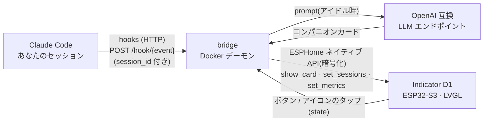

# Indicator AI Companion

[English](README.md) · [简体中文](README.zh-CN.md) · **日本語**

**Seeed SenseCAP Indicator D1**(ESP32-S3 + 4インチ 480×480 タッチスクリーン)を、
**Claude Code の物理ステータスディスプレイ(HUD)+ AI デスクコンパニオン** に変えるプロジェクト。
落ち着いたダークな雰囲気の UI。

- **Claude Code HUD** — Claude Code の hooks を通じて、エージェントの今の状態をリアルタイム表示:
  思考中 / 実行中のツール / 確認待ち / 完了。
- **マルチセッションのアイコンバー** — 複数のターミナルで Claude Code を同時に走らせると、各セッションが
  上部に **Claude のスパークアイコン** を 1 つずつ持つ(最大 4 つ)。そのセッションが作業中はスパークが
  **呼吸**し、アイコン下のプロジェクト名は status で色分けされる。**アイコンをタップ** すると詳細カードが
  そのセッションに切り替わる(画面はタッチ対応;タップは device↔bridge のローカル閉ループで、Claude Code には戻さない)。
- **AI コンパニオンカード** — アクティブなセッションが無い時にローカル/LAN の LLM が短く温かい一言を生成。
  デバイスの物理ボタンを押すと別のカードに切り替わる。
- **多言語** — UI とコンパニオンの文言を環境変数 `BRIDGE_LANG` 一つで `zh` / `en` に切り替え。
  言語の追加も容易。

## デモ


## 仕組み



LLM はすべてデバイス外で動作する(ボードの性能では動かせない)。デバイスは表示・タッチ・状態報告のみ。
bridge は `session_id` でイベントを束ね、セッションレジストリを保持し、**意味だけを push し、フレームは push しない**:
言語非依存の `status`(`run`/`think`/`wait`/`done`/`ready`/`online`)がデバイス側の色/アニメーションを駆動し
(Claude のスパークは作業中ローカルで**呼吸**する)、ローカライズされた `mood`/`title`/`body` はテキスト表示。
アイコンのタップはフォーカス中のセッションを切り替える device↔bridge の閉ループで、Claude Code には戻さない。
詳細は [docs/ARCHITECTURE.md](docs/ARCHITECTURE.md)。

## ハードウェア

| | |
|---|---|
| MCU | ESP32-S3(WiFi/BLE、ESPHome + LVGL を実行) |
| コプロセッサ | RP2040(本プロジェクトでは未使用) |
| ディスプレイ | 4インチ 480×480 IPS 静電容量タッチ(ST7701S + FT5x06) |
| シリアル | ESP32-S3 は CH340 経由 → `/dev/cu.usbserial-*` |

**フォント / CJK:** LVGL 内蔵の `montserrat` には CJK グリフがないため、本プロジェクトは単一 face の
CJK フォント(PingFang SC / Hiragino Sans GB)を埋め込み、GB2312 第一水準(約 3800 字)+ ASCII をカバー。
英語は ASCII 範囲でそのまま表示される。それ以外の文字(例:日本語の仮名)はフォントのグリフセット拡張が必要。

## ディレクトリ構成

```
indicator-ai-companion/
├── firmware/                        # ESPHome ファームウェア(LVGL UI + WiFi + 暗号化 API)
│   ├── indicator-companion.yaml     # デバイス設定;show_card(status,mood,title,body,footer)
│   ├── glyphs_zh.yaml / glyphs_full.yaml   # 埋め込みグリフセット
│   ├── fonts/extract-font.py        # システムフォントから ChineseFont.ttf を再生成(gitignore 対象)
│   ├── images/{bg.svg,gen-eyes.py}  # 背景 + まばたきする目のフレーム生成
│   └── secrets.yaml.example         # WiFi / API キーのテンプレート
├── bridge/                          # Python デーモン(Docker 常駐)
│   ├── indicator_bridge/            # app, cards, companion, device, config, i18n
│   └── .env.example                 # デバイスアドレス、暗号化キー、コンパニオンのエンドポイント、言語
├── hooks/                           # Claude Code 連携
│   ├── push-event.sh                # hook -> bridge 転送(fire-and-forget)
│   ├── statusline-wrapper.sh        # claude-hud をラップ + context/limit メトリクスを push
│   └── settings.snippet.json        # ~/.claude/settings.json に貼り付け
└── docker-compose.yml
```

## はじめに

### 0. アセットのビルド(初回のみ)

```bash
cd firmware
uv run --with fonttools fonts/extract-font.py     # CJK フォントを再生成(著作権あり;リポジトリ非収録)
# images/bg.svg を編集した後に背景を再ラスタライズ:
uv run --with cairosvg python -c "import cairosvg; cairosvg.svg2png(url='images/bg.svg', write_to='images/bg.png', output_width=480, output_height=480)"
# まばたきする目のフレームを再生成:
uv run --with pillow --with numpy images/gen-eyes.py
# Claude スパークのフレームを再生成(セッションアイコン;公式ブランド SVG から):
uv run --with cairosvg --with pillow images/gen-claude.py
```

### 1. ファームウェアの書き込み

```bash
cp firmware/secrets.yaml.example firmware/secrets.yaml   # WiFi を記入し api_key を生成
cd firmware
uv run --with esphome esphome config indicator-companion.yaml          # まず検証
uv run --with esphome esphome run indicator-companion.yaml --device /dev/cu.usbserial-XXXX
```

初回は USB 経由で書き込む必要がある(約 30 秒、最も安定)。以降は接続が良好なら WiFi 経由の OTA が使える:
`--device <デバイスIP>`。

> `show_card` の引数を変更した場合(本バージョンで `status` を追加)、デバイスと bridge を同期させるため
> 再書き込みすること。

### 2. bridge の起動

```bash
cp bridge/.env.example bridge/.env   # INDICATOR_NOISE_PSK == ファームウェアの api_key、BRIDGE_LANG を選択
docker compose up -d --build
docker logs indicator-bridge -f
```

Docker を使わず直接実行することもできる:`cd bridge && uv run indicator-bridge`。

コンパニオンカードは任意の OpenAI 互換エンドポイント(ローカルの LM Studio / LAN の推論サーバー、キー不要)を使う。
エンドポイントに到達できない場合はコンパニオンカードが出ないだけで、HUD は引き続き動作する。

### 3. Claude Code hooks の接続

`hooks/settings.snippet.json` の `hooks` ブロックを `~/.claude/settings.json`(グローバル)または
プロジェクトの `.claude/settings.json` にマージし、`/ABS/PATH/TO` をこのリポジトリの絶対パスに置き換える。
セッションを再起動すると有効になる。

## ステータスマッピング(HUD)

| Claude Code イベント | status | 表示 |
|---|---|---|
| SessionStart | `ready` | 現在のプロジェクト名 |
| UserPromptSubmit | `think` | リクエストを受領 |
| PreToolUse | `run` | ツール名 + 概要(コマンド / ファイル / grep …) |
| Notification | `wait` | 通知内容(権限/入力待ち) |
| Stop | `done` | このターンのツール呼び出し回数 |
| SessionEnd | — | そのセッションをアイコンバーから削除 |

`status` は言語非依存でデバイス側の色を駆動する。表示される `mood`/`title`/`body` は `BRIDGE_LANG` に従う。
各イベントは `session_id` を持つため、アイコンバーは各セッションを個別に追跡する——スパークは `run`/`think` で
呼吸し、下のプロジェクト名は status で色分けされる。詳細カードは**フォーカス中**のセッション(既定では直近に
アクティブなもの;アイコンをタップすると約 45 秒ピン留め)を表示する。

## 言語

`bridge/.env` で `BRIDGE_LANG` を設定 — `zh`(既定)または `en`。言語を追加するには、
`bridge/indicator_bridge/i18n.py` に `Strings` を追加(さらに `companion.py` にその言語の system prompt を追加)。
GB2312 + ASCII を超えるグリフが必要な場合は、ファームウェアのフォントも拡張すること。

## トラブルシューティング

- **設定の検証:** `uv run --with esphome esphome config firmware/indicator-companion.yaml`
- **画面が黒い/暗い:** USB ケーブルを確認(給電専用ではなくデータ用であること);115200 baud で起動ログを確認。
- **bridge が接続できない:** `.env` の `INDICATOR_HOST` をデバイス IP に設定。`INDICATOR_NOISE_PSK` は
  `firmware/secrets.yaml` の `api_key` と一致している必要がある。
- **豆腐(文字化け):** その文字が埋め込みフォントにない。`glyphs_zh.yaml` を拡張(例:GB2312 第二水準を追加)して再書き込み。
- **hooks が反応しない:** 手動で 1 回叩く —
  `curl -m1 -XPOST http://127.0.0.1:9527/hook/stop -d '{"cwd":"/x/y"}'`;
  `curl http://127.0.0.1:9527/healthz` で bridge を確認。
- **WiFi は `power_save_mode: none` 必須:** ESP32 のモデムスリープを無効化しないと、深刻なパケットロスや
  noise ハンドシェイクのタイムアウトが発生する。接続不安定の最大の原因。

## ロードマップ

- セッション単位のメトリクス(`set_metrics` は現状グローバル;`session_id` 経由に変更)。
- `transcript_path` から token/コストを解析し、Stop カードにこのターンのコストを表示。
- bridge を launchd サービス化して自動起動。
- 言語の追加;D1S/D1Pro バリアントでセンサー対応の「環境執事」。

## ライセンス

[MIT](LICENSE) © 2026 Yufei Kang
