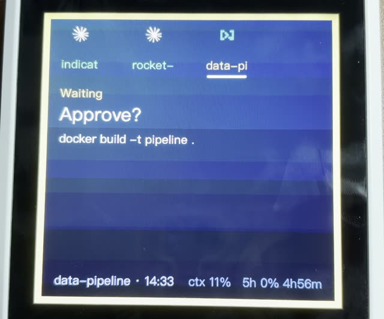
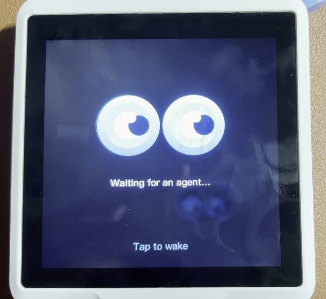
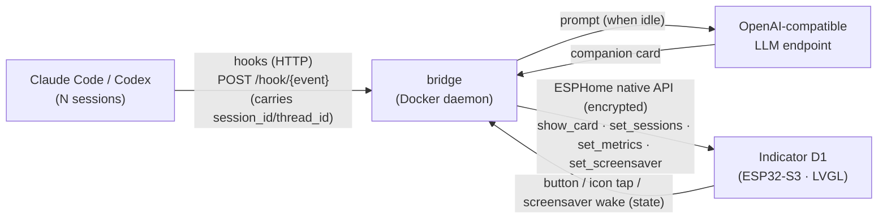

# Indicator AI Companion

**English** · [简体中文](README.zh-CN.md) · [日本語](README.ja.md)

Turn a **Seeed SenseCAP Indicator D1** (ESP32-S3 + 4″ 480×480 touch screen) into a
**physical status display (HUD) for Claude Code / Codex + an AI desk companion**, with a calm
dark ambient UI.

- **Agent HUD** — via Claude Code or Codex hooks, the screen shows in real time what your
  agent is doing: thinking / which tool is running / waiting for your confirmation / done.
- **Multi-session icon strip** — run Claude Code / Codex in several terminals at once and each
  session gets its own provider icon across the top (up to 4): Claude sessions show the Claude
  spark, Codex sessions show a Codex code mark. The icon breathes
  while that session is working; the project name under it is color-coded by status.
  **Tap an icon** to switch the detail card to that session (the screen is touch; the tap
  loop is device↔bridge only — it does not feed back into the agent).
- **AI companion cards** — when no session is active, a local/LAN LLM generates a short
  warm or witty line; press the device button to swap to a fresh one.
- **Screensaver** — after `SCREENSAVER_SECONDS` (default 300s) with no agent activity, the
  screen turns into full-screen blinking eyes with one cheeky line (LLM-generated, with a
  built-in fallback). Tap anywhere to wake. It won't kick in while a "needs you" prompt is
  pending, so urgent alerts are never hidden.
- **Multi-language** — UI and companion text switch between `zh` / `en` via one env var
  (`BRIDGE_LANG`), and the design makes adding more languages easy.

## Demo

Real hardware — click a thumbnail to play the video:

| Agent HUD — multi-session status | Idle screensaver — blinking eyes |
| :---: | :---: |
| [](docs/media/demo-full.mp4) | [](docs/media/demo-eyes.mp4) |

## How it works



All LLM work runs off-device (the board can't host it). The device only displays,
handles touch, and reports state. The bridge keys events by `session_id` / `thread_id`, keeps a small
session registry, and pushes **semantics, never frames**: a language-independent `status`
(`run`/`think`/`wait`/`done`/`ready`/`online`) drives on-device color/animation (the provider
icon *breathes* locally while working), while the localized `mood`/`title`/`body` show as
text. Tapping an icon switches the focused session — a device↔bridge loop that never feeds
back into the agent. See [docs/ARCHITECTURE.md](docs/ARCHITECTURE.md).

## Hardware

| | |
|---|---|
| MCU | ESP32-S3 (WiFi/BLE, runs ESPHome + LVGL) |
| Co-processor | RP2040 (unused here) |
| Display | 4″ 480×480 IPS capacitive touch (ST7701S + FT5x06) |
| Serial | ESP32-S3 over CH340 → `/dev/cu.usbserial-*` |

**Fonts / CJK:** LVGL's built-in `montserrat` has no CJK glyphs, so this project embeds
a single-face CJK font (PingFang SC / Hiragino Sans GB) covering GB2312 level-1 (~3800
chars) + ASCII. English renders from the ASCII range out of the box; other scripts
(e.g. Japanese kana) need the font's glyph set expanded.

## Layout

```
indicator-ai-companion/
├── firmware/                        # ESPHome firmware (LVGL UI + WiFi + encrypted API)
│   ├── indicator-companion.yaml     # device config; show_card(status,mood,title,body,footer)
│   ├── glyphs_zh.yaml / glyphs_full.yaml   # embedded glyph sets
│   ├── fonts/extract-font.py        # rebuild ChineseFont.ttf from a system font (gitignored)
│   ├── images/                      # bg.svg + session icon generators (gen-claude.py / gen-codex.py)
│   └── secrets.yaml.example         # WiFi / API key template
├── bridge/                          # Python daemon (Docker resident)
│   ├── indicator_bridge/            # app, cards, companion, device, config, i18n, demo
│   └── .env.example                 # device addr, encryption key, companion endpoint, lang
├── hooks/                           # Claude Code / Codex glue
│   ├── push-event.sh                # hook -> bridge forwarder (fire-and-forget)
│   ├── statusline-wrapper.sh        # Claude-only: wraps claude-hud + pushes context/limit metrics
│   ├── settings.snippet.json        # paste into ~/.claude/settings.json
│   └── codex-hooks.snippet.json     # paste into ~/.codex/hooks.json
└── docker-compose.yml
```

## Getting started

### 0. Build assets (one-time)

```bash
cd firmware
uv run --with fonttools fonts/extract-font.py     # rebuild the CJK font (copyright; not in repo)
# regenerate the background after editing images/bg.svg:
uv run --with cairosvg python -c "import cairosvg; cairosvg.svg2png(url='images/bg.svg', write_to='images/bg.png', output_width=480, output_height=480)"
# regenerate the Claude spark frames (session icon):
uv run --with cairosvg --with pillow images/gen-claude.py
# regenerate the Codex code-mark frames (session icon):
uv run python images/gen-codex.py
```

### 1. Flash the firmware

```bash
cp firmware/secrets.yaml.example firmware/secrets.yaml   # then fill WiFi + generate api_key
cd firmware
uv run --with esphome esphome config indicator-companion.yaml          # validate first
uv run --with esphome esphome run indicator-companion.yaml --device /dev/cu.usbserial-XXXX
```

First flash must be over USB (~30s, most reliable). After that, OTA over WiFi works
when the link is good: `--device <device-ip>`.

> When the device-side API changes (this version added the `set_screensaver` action and a
> `screensaver_wake` sensor), reflash so the device and bridge stay in sync.

### 2. Run the bridge

```bash
cp bridge/.env.example bridge/.env   # set INDICATOR_NOISE_PSK == firmware api_key, pick BRIDGE_LANG
docker compose up -d --build
docker logs indicator-bridge -f
```

Or run it directly without Docker: `cd bridge && uv run indicator-bridge`.

The companion card uses any OpenAI-compatible endpoint (local LM Studio / a LAN
inference server, no key needed). If the endpoint is unreachable you just get no
companion card — the HUD keeps working.

### 3. Wire up agent hooks

Claude Code: merge the `hooks` block from `hooks/settings.snippet.json` into
`~/.claude/settings.json` (global) or a project `.claude/settings.json`, replacing
`/ABS/PATH/TO` with this repo's absolute path. Restart the session to take effect.

Codex: merge the `hooks` block from `hooks/codex-hooks.snippet.json` into
`~/.codex/hooks.json` (global) or a trusted project `.codex/hooks.json`, replacing
`/ABS/PATH/TO` with this repo's absolute path. Review and trust the hook from Codex `/hooks`.

### 4. Demo mode (no agent needed)

With the bridge running, replay a scripted fake event stream — multi-session strip
(Claude + Codex), tool cards, "needs you" alerts, focus switching, metrics. All data
is fictional; handy for a smoke test or recording a video:

```bash
cd bridge && uv run indicator-bridge-demo          # ~2 min; --speed 2 / --loop
```

To also capture the companion card and screensaver, lower `IDLE_SECONDS` /
`SCREENSAVER_SECONDS` in `bridge/.env` before recording.

## Status mapping (HUD)

| Event | status | shown |
|---|---|---|
| SessionStart | `ready` | current project name |
| UserPromptSubmit | `think` | "got your request" |
| PreToolUse | `run` | tool name + summary (command / file / grep …) |
| Notification (Claude) / PermissionRequest (Codex) | `wait` | awaiting permission/input |
| PostToolUse | `think` | clears a wait alert after permission/input |
| Stop | `done` | tool-call count this turn |
| SessionEnd (Claude / synthetic Codex) | — | session removed from the icon strip; Codex uses a parent-process watcher, with TTL as fallback |

`status` is language-independent and drives the on-device color; the visible
`mood`/`title`/`body` follow `BRIDGE_LANG`. Events carry a `session_id` or `thread_id`, so the
strip tracks every session independently — the spark icon breathes for `run`/`think`,
and the project name under it is tinted by status. The detail card shows the **focused**
session (most recently active by default; tap an icon to pin one for ~45s).

## Languages

Set `BRIDGE_LANG` in `bridge/.env` — `zh` (default) or `en`. To add a language, add a
`Strings` entry in `bridge/indicator_bridge/i18n.py` (and a companion system prompt in
`companion.py`); if it needs glyphs beyond GB2312 + ASCII, expand the firmware font too.

## Troubleshooting

- **Validate config:** `uv run --with esphome esphome config firmware/indicator-companion.yaml`
- **Black/dim screen:** check the USB cable (must be a data cable, not power-only); read the
  boot log at 115200 baud.
- **Bridge can't connect:** set `INDICATOR_HOST` in `.env` to the device IP; `INDICATOR_NOISE_PSK`
  must equal `api_key` in `firmware/secrets.yaml`.
- **Tofu boxes (missing glyphs):** that char isn't in the embedded font; expand `glyphs_zh.yaml`
  (e.g. add GB2312 level-2) and reflash.
- **Hooks do nothing:** fire one manually —
  `curl -m1 -XPOST http://127.0.0.1:9527/hook/stop -d '{"cwd":"/x/y"}'`; check
  `curl http://127.0.0.1:9527/healthz`.
- **WiFi must use `power_save_mode: none`:** without disabling ESP32 modem sleep you get
  heavy packet loss and noise-handshake timeouts. This is the #1 cause of an unstable link.

## Roadmap

- Per-session metrics (`set_metrics` is still global; route it through `session_id`).
- Parse token/cost from `transcript_path`; show this turn's cost on the Stop card.
- Ship the bridge as a launchd service for auto-start.
- More languages; sensor-aware "environment butler" on D1S/D1Pro variants.

## License

[MIT](LICENSE) © 2026 Yufei Kang
