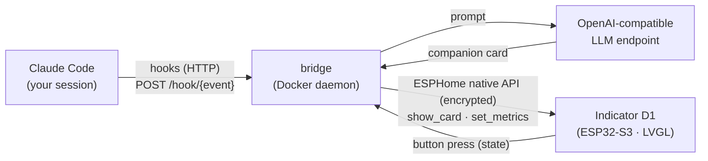

# Indicator AI Companion

**English** · [简体中文](README.zh-CN.md) · [日本語](README.ja.md)

Turn a **Seeed SenseCAP Indicator D1** (ESP32-S3 + 4″ 480×480 touch screen) into a
**physical status display (HUD) for Claude Code + an AI desk companion**, with a calm
dark ambient UI.

- **Claude Code HUD** — via Claude Code hooks, the screen shows in real time what your
  agent is doing: thinking / which tool is running / waiting for your confirmation / done.
- **AI companion cards** — when idle, a local/LAN LLM generates a short warm or witty
  line; press the device button to swap to a fresh one.
- **Multi-language** — UI and companion text switch between `zh` / `en` via one env var
  (`BRIDGE_LANG`), and the design makes adding more languages easy.

## Demo


## How it works



All LLM work runs off-device (the board can't host it). The device only displays,
handles touch, and reports the button. The bridge pushes **semantics, never frames**:
a language-independent `status` key (`run`/`think`/`wait`/`done`/`ready`/`online`)
drives on-device color/animation, while the localized `mood`/`title`/`body` are shown
as text. See [docs/ARCHITECTURE.md](docs/ARCHITECTURE.md).

## Hardware

| | |
|---|---|
| MCU | ESP32-S3 (WiFi/BLE, runs ESPHome + LVGL) |
| Co-processor | RP2040 (unused here) |
| Display | 4″ 480×480 IPS capacitive touch (ST7701S + FT5x06) |
| Serial | ESP32-S3 over CH340 → `/dev/cu.usbserial-*` |

**Fonts / CJK:** LVGL's built-in `montserrat` has no CJK glyphs, so this project embeds
a single-face CJK font (PingFang SC / Hiragino Sans GB) covering GB2312 level-1 (~3800
chars) + ASCII. English renders from the ASCII range out of the box; other scripts
(e.g. Japanese kana) need the font's glyph set expanded.

## Layout

```
indicator-ai-companion/
├── firmware/                        # ESPHome firmware (LVGL UI + WiFi + encrypted API)
│   ├── indicator-companion.yaml     # device config; show_card(status,mood,title,body,footer)
│   ├── glyphs_zh.yaml / glyphs_full.yaml   # embedded glyph sets
│   ├── fonts/extract-font.py        # rebuild ChineseFont.ttf from a system font (gitignored)
│   ├── images/{bg.svg,gen-eyes.py}  # background + blinking-eyes frame generator
│   └── secrets.yaml.example         # WiFi / API key template
├── bridge/                          # Python daemon (Docker resident)
│   ├── indicator_bridge/            # app, cards, companion, device, config, i18n
│   └── .env.example                 # device addr, encryption key, companion endpoint, lang
├── hooks/                           # Claude Code glue
│   ├── push-event.sh                # hook -> bridge forwarder (fire-and-forget)
│   ├── statusline-wrapper.sh        # wraps claude-hud + pushes context/limit metrics
│   └── settings.snippet.json        # paste into ~/.claude/settings.json
└── docker-compose.yml
```

## Getting started

### 0. Build assets (one-time)

```bash
cd firmware
uv run --with fonttools fonts/extract-font.py     # rebuild the CJK font (copyright; not in repo)
# regenerate the background after editing images/bg.svg:
uv run --with cairosvg python -c "import cairosvg; cairosvg.svg2png(url='images/bg.svg', write_to='images/bg.png', output_width=480, output_height=480)"
# regenerate the blinking-eyes frames:
uv run --with pillow --with numpy images/gen-eyes.py
```

### 1. Flash the firmware

```bash
cp firmware/secrets.yaml.example firmware/secrets.yaml   # then fill WiFi + generate api_key
cd firmware
uv run --with esphome esphome config indicator-companion.yaml          # validate first
uv run --with esphome esphome run indicator-companion.yaml --device /dev/cu.usbserial-XXXX
```

First flash must be over USB (~30s, most reliable). After that, OTA over WiFi works
when the link is good: `--device <device-ip>`.

> If you change `show_card`'s arguments (this version added `status`), reflash so the
> device and bridge stay in sync.

### 2. Run the bridge

```bash
cp bridge/.env.example bridge/.env   # set INDICATOR_NOISE_PSK == firmware api_key, pick BRIDGE_LANG
docker compose up -d --build
docker logs indicator-bridge -f
```

Or run it directly without Docker: `cd bridge && uv run indicator-bridge`.

The companion card uses any OpenAI-compatible endpoint (local LM Studio / a LAN
inference server, no key needed). If the endpoint is unreachable you just get no
companion card — the HUD keeps working.

### 3. Wire up Claude Code hooks

Merge the `hooks` block from `hooks/settings.snippet.json` into `~/.claude/settings.json`
(global) or a project `.claude/settings.json`, replacing `/ABS/PATH/TO` with this repo's
absolute path. Restart the session to take effect.

## Status mapping (HUD)

| Claude Code event | status | shown |
|---|---|---|
| SessionStart | `ready` | current project name |
| UserPromptSubmit | `think` | "got your request" |
| PreToolUse | `run` | tool name + summary (command / file / grep …) |
| Notification | `wait` | the notification (awaiting permission/input) |
| Stop | `done` | tool-call count this turn |

`status` is language-independent and drives the on-device color; the visible
`mood`/`title`/`body` follow `BRIDGE_LANG`.

## Languages

Set `BRIDGE_LANG` in `bridge/.env` — `zh` (default) or `en`. To add a language, add a
`Strings` entry in `bridge/indicator_bridge/i18n.py` (and a companion system prompt in
`companion.py`); if it needs glyphs beyond GB2312 + ASCII, expand the firmware font too.

## Troubleshooting

- **Validate config:** `uv run --with esphome esphome config firmware/indicator-companion.yaml`
- **Black/dim screen:** check the USB cable (must be a data cable, not power-only); read the
  boot log at 115200 baud.
- **Bridge can't connect:** set `INDICATOR_HOST` in `.env` to the device IP; `INDICATOR_NOISE_PSK`
  must equal `api_key` in `firmware/secrets.yaml`.
- **Tofu boxes (missing glyphs):** that char isn't in the embedded font; expand `glyphs_zh.yaml`
  (e.g. add GB2312 level-2) and reflash.
- **Hooks do nothing:** fire one manually —
  `curl -m1 -XPOST http://127.0.0.1:9527/hook/stop -d '{"cwd":"/x/y"}'`; check
  `curl http://127.0.0.1:9527/healthz`.
- **WiFi must use `power_save_mode: none`:** without disabling ESP32 modem sleep you get
  heavy packet loss and noise-handshake timeouts. This is the #1 cause of an unstable link.

## Roadmap

- Status-driven accent colors on the eyes/animation, not just the mood label.
- Parse token/cost from `transcript_path`; show this turn's cost on the Stop card.
- Ship the bridge as a launchd service for auto-start.
- More languages; sensor-aware "environment butler" on D1S/D1Pro variants.

## License

[MIT](LICENSE) © 2026 Yufei Kang
