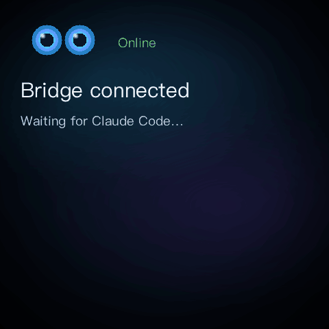
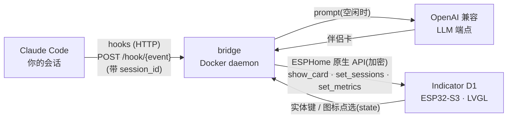

# Indicator AI Companion

[English](README.md) · **简体中文** · [日本語](README.ja.md)

把一台 **Seeed SenseCAP Indicator D1**(ESP32-S3 + 4″ 480×480 触摸屏)变成桌面上的
**Claude Code 物理状态屏(HUD)+ AI 桌面伴侣**,深色氛围背景。

- **Claude Code HUD**:通过 Claude Code 的 hooks,屏幕实时显示「我」在干嘛——
  思考中 / 正在跑哪个工具 / 卡在等你确认 / 任务完成。
- **多 session 图标条**:同时在多个终端跑 Claude Code,每个会话在顶部各占一个
  **Claude 星芒图标**(最多 4 个)。该会话工作时星芒**呼吸**,图标下方的项目名按状态上色。
  **点一下图标**即把详情卡切到那个会话(屏幕可触摸;点选只在设备↔bridge 本地闭环,不回传 Claude Code)。
- **AI 伴侣卡片**:无活跃会话时由本地/局域网大模型生成一句温暖或机智的话;按一下设备实体键立刻换一张。
- **多语言**:UI 与伴侣卡文案通过一个环境变量(`BRIDGE_LANG`)在 `zh` / `en` 间切换,新增语言也方便。

## 演示



## 工作原理



LLM 全跑在设备之外(设备算力不够)。设备只负责显示 + 触摸 + 上报状态。bridge 按 `session_id`
维护会话注册表,**只推语义、绝不推帧**:语言无关的 `status`(`run`/`think`/`wait`/`done`/`ready`/`online`)
驱动设备端配色/动画(Claude 星芒在工作时**本地呼吸**),本地化的 `mood`/`title`/`body` 作为文本显示。
点图标切换焦点会话——纯设备↔bridge 闭环,不回传 Claude Code。详见 [docs/ARCHITECTURE.md](docs/ARCHITECTURE.md)。

## 硬件

| | |
|---|---|
| 主控 | ESP32-S3(WiFi/BLE,跑 ESPHome + LVGL) |
| 协处理器 | RP2040(本项目未使用) |
| 屏幕 | 4″ 480×480 IPS 电容触摸(ST7701S + FT5x06) |
| 串口 | ESP32-S3 走 CH340 → `/dev/cu.usbserial-*` |

**中文显示**:LVGL 内置 `montserrat` 无中文字形,本项目内嵌单 face 中文字体
(苹方 / Hiragino Sans GB)的 GB2312 一级常用字(约 3800 字)+ ASCII。英文走 ASCII 区开箱即用;
其他字形(如日文假名)需扩充字库。

## 目录结构

```
indicator-ai-companion/
├── firmware/                        # ESPHome 固件(LVGL UI + WiFi + 加密 API)
│   ├── indicator-companion.yaml     # 设备配置;show_card(status,mood,title,body,footer)
│   ├── glyphs_zh.yaml / glyphs_full.yaml   # 内嵌字库字表
│   ├── fonts/extract-font.py        # 从系统字体重建 ChineseFont.ttf(版权,不入库)
│   ├── images/{bg.svg,gen-eyes.py}  # 背景图 + 眨眼眼睛帧生成
│   └── secrets.yaml.example         # WiFi / API key 模板
├── bridge/                          # Python daemon(Docker 常驻)
│   ├── indicator_bridge/            # app、cards、companion、device、config、i18n
│   └── .env.example                 # 设备地址、加密 key、伴侣卡端点、语言
├── hooks/                           # Claude Code 胶水
│   ├── push-event.sh                # hook -> bridge 转发器(发了就走,不阻塞)
│   ├── statusline-wrapper.sh        # 包装 claude-hud + 推 context/limit 指标
│   └── settings.snippet.json        # 粘进 ~/.claude/settings.json 的片段
└── docker-compose.yml
```

## 上手

### 0. 准备资源(一次性)

```bash
cd firmware
uv run --with fonttools fonts/extract-font.py     # 重建中文字体(含版权,不入库)
# 改 images/bg.svg 后重新栅格化:
uv run --with cairosvg python -c "import cairosvg; cairosvg.svg2png(url='images/bg.svg', write_to='images/bg.png', output_width=480, output_height=480)"
# 重新生成眨眼眼睛帧:
uv run --with pillow --with numpy images/gen-eyes.py
# 重新生成 Claude 星芒帧(session 图标,取自官方品牌 SVG):
uv run --with cairosvg --with pillow images/gen-claude.py
```

### 1. 刷固件

```bash
cp firmware/secrets.yaml.example firmware/secrets.yaml   # 填 WiFi + 生成 api_key
cd firmware
uv run --with esphome esphome config indicator-companion.yaml          # 先校验
uv run --with esphome esphome run indicator-companion.yaml --device /dev/cu.usbserial-XXXX
```

首次必须 USB 烧录(~30s,最稳);之后 WiFi 好时可走 OTA:`--device <设备IP>`。

> 改了 `show_card` 的参数(本版新增了 `status`)就要重刷一次,保证设备与 bridge 同步。

### 2. 起 bridge

```bash
cp bridge/.env.example bridge/.env   # INDICATOR_NOISE_PSK == 固件 api_key;选 BRIDGE_LANG
docker compose up -d --build
docker logs indicator-bridge -f
```

也可不走 Docker 直接跑:`cd bridge && uv run indicator-bridge`。

伴侣卡走任意 OpenAI 兼容端点(本地 LM Studio / 局域网推理服务,免 key)。
端点不可达时只是没有伴侣卡,HUD 照常工作。

### 3. 接 Claude Code hooks

把 `hooks/settings.snippet.json` 的 `hooks` 块合并进 `~/.claude/settings.json`(全局)或项目
`.claude/settings.json`,把 `/ABS/PATH/TO` 换成本仓库绝对路径,重开会话即生效。

## 状态映射(HUD)

| Claude Code 事件 | status | 内容 |
|---|---|---|
| SessionStart | `ready` | 当前项目名 |
| UserPromptSubmit | `think` | 收到你的请求 |
| PreToolUse | `run` | 工具名 + 摘要(命令 / 文件名 / grep 等) |
| Notification | `wait` | 通知内容(等待权限/输入) |
| Stop | `done` | 本回合工具调用次数 |
| SessionEnd | — | 该会话从图标条移除 |

`status` 语言无关、驱动设备端配色;屏幕上的 `mood`/`title`/`body` 跟随 `BRIDGE_LANG`。每个事件都带
`session_id`,图标条因此独立跟踪每个会话——星芒在 `run`/`think` 时呼吸,下方项目名按状态上色。
详情卡显示**焦点**会话(默认跟最近活跃;点某图标可钉住它约 45s)。

## 语言

在 `bridge/.env` 设 `BRIDGE_LANG` —— `zh`(默认)或 `en`。新增语言:在
`bridge/indicator_bridge/i18n.py` 加一个 `Strings`(再在 `companion.py` 加该语言的 system prompt);
若用到 GB2312 + ASCII 之外的字形,同步扩固件字库。

## 故障排查

- **校验配置**:`uv run --with esphome esphome config firmware/indicator-companion.yaml`
- **屏幕黑/不亮**:检查 USB 数据线(非纯供电线);串口 115200 看启动日志。
- **bridge 连不上**:`.env` 的 `INDICATOR_HOST` 改成设备 IP;`INDICATOR_NOISE_PSK` 必须 ==
  `firmware/secrets.yaml` 的 `api_key`。
- **屏幕缺字(豆腐块)**:该字不在内嵌字库;扩大 `glyphs_zh.yaml`(如加 GB2312 二级)重刷。
- **hook 没反应**:手动打一发 `curl -m1 -XPOST http://127.0.0.1:9527/hook/stop -d '{"cwd":"/x/y"}'`;
  `curl http://127.0.0.1:9527/healthz` 查 bridge。
- **WiFi 必须 `power_save_mode: none`**:不关 ESP32 modem sleep 会严重丢包、noise 握手超时,
  是连接不稳的头号根因。

## 后续

- 按 session 分流指标(`set_metrics` 目前还是全局,改成跟 `session_id` 走)。
- 从 `transcript_path` 解析 token/耗时,Stop 卡显示本回合成本。
- 把 bridge 做成 launchd 开机自启。
- 更多语言;在 D1S/D1Pro 上接传感器做环境管家。

## 许可

[MIT](LICENSE) © 2026 Yufei Kang
