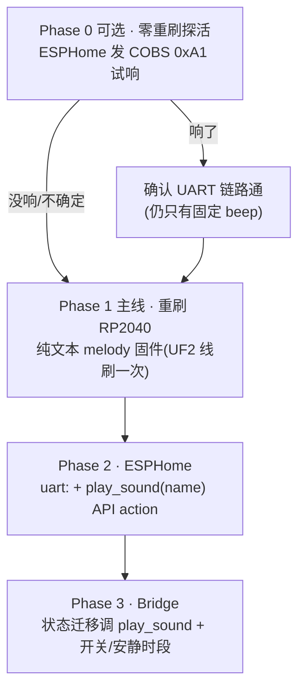
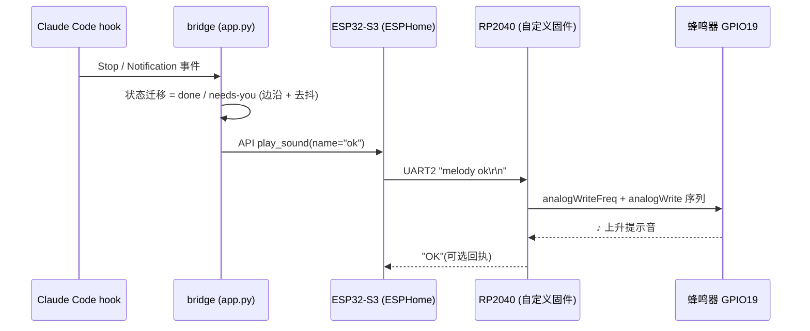

# RP2040 蜂鸣器 → 听觉反馈方案

> 目标:让设备在 Claude Code 状态变化(尤其 **needs-you / done**)时**发声提醒**,把单一的"看屏"通道扩展成"听觉"通道。
> 用户诉求:**用蜂鸣器近似一个 speaker 的效果**(音效 / 旋律,而非真语音)。

## TL;DR(结论)

| 问题 | 结论 |
|---|---|
| 能近似 speaker 吗? | **能** —— 蜂鸣器是**无源 PWM 压电片**,频率可控,可出单音 / 旋律 / jingle / chirp。**做不到** PCM 语音、说话、多声部音乐。 |
| 蜂鸣器接在哪? | **RP2040 GPIO19**(PWM)。**不在 ESP32-S3** —— 我们 ESPHome 跑的那颗碰不到它。 |
| 怎么让它响? | ESP32-S3 通过**跨芯片 UART**给 RP2040 发命令,RP2040 驱动 GPIO19。 |
| UART 在哪? | ESP32-S3 **UART2 `GPIO19(TX)/GPIO20(RX)`** ↔ RP2040 **`Serial1` `GPIO16(TX)/GPIO17(RX)`**,115200 8N1。两脚在我们当前 ESPHome 里**空闲**。 |
| 要重刷 RP2040 吗? | **要旋律/音效就要**(出厂固件最多一个固定 beep)。RP2040 经 BOOTSEL 拖 UF2 刷写,**几乎不可砖**,有独立 USB-C 口,不影响 ESP32。 |
| 推荐协议 | **纯文本 CLI**(`melody err\r\n`),从 ESPHome `uart.write` 一行搞定,远比 COBS 二进制好接。 |
| 改动面 | RP2040:一份新固件(UF2,线刷一次)。ESP32 ESPHome:加 `uart:` + 一个 `play_sound` API action。Bridge:状态迁移时调 `play_sound` + 开关/安静时段。 |

---

## 1. 硬件事实(全部来自实源码,见 §8 出处)

### 1.1 双 MCU 分工
- **ESP32-S3**:屏幕 / 触摸 / 背光 / WiFi·BLE·LoRa / IO 扩展器 —— **我们 ESPHome 固件跑在这颗**。
- **RP2040**:传感器(VOC/CO2,仅 D1S/D1Pro)/ **蜂鸣器** / SD 卡 / Grove 口。
- 两颗芯片**各有一个独立 USB-C 口**(Port1=ESP32,Port2=RP2040),互不干扰。

### 1.2 蜂鸣器
- **RP2040 GPIO19**,PWM 驱动。
- **无源(passive)已确认**:社区固件用 `analogWriteFreq(freq)` 设频率 + `analogWrite(pin, duty)` 设占空比,在实机放出 `tone/note/melody`。→ **频率可控 = 能出音高 = 能放旋律**。
- **音量 = 占空比**(128 ≈ 50% 最响;Seeed 报警示例用 duty=10 做小声)。
- **天花板**:单声道方波压电片。
  - ✅ 提示音、开机/成功/报错/告警 jingle、R2-D2 式 chirp、单声部小旋律。
  - ❌ PCM 语音、说话、多声部音乐。
  - ⚠️ 压电片谐振峰约 2–4kHz,这一带最响;低频(<500Hz)很弱,旋律"低音"几乎听不见。

### 1.3 跨芯片 UART(PCB 硬连,不可改;三方源码交叉一致)
```
ESP32-S3 (UART2)                         RP2040 (Serial1)
  GPIO19  TX  ───────────────────────►   GPIO17  RX
  GPIO20  RX  ◄───────────────────────   GPIO16  TX
            115200 8N1 (Seeed 视觉示例用 921600;两侧必须一致)
```
- GPIO19/20 是 ESP32-S3 的原生 USB D-/D+ 脚,但本板 USB-C 经独立桥接,这两脚被腾出来专做 RP2040 链路(Seeed 官方固件即如此用)。

### 1.4 与我们当前 ESPHome 的引脚冲突核对
| 我们已占用 | 引脚 |
|---|---|
| logger(UART0) | GPIO43/44 |
| I2C(触摸/PCA9554) | 39 / 40 |
| SPI LCD | 41 / 47 / 48 |
| 背光(ledc) | 45 |
| 刷新键 | 38 |

→ **GPIO19 / GPIO20 不在其中,空闲可用**。UART0 被 logger 占,ESPHome 会自动把新 `uart:` 分到另一个空闲 UART 外设(不影响 logger)。
> ⚠️ 实刷时确认 ESPHome 没启用 native USB(我们 logger 走 UART0,不走 USB_SERIAL_JTAG/CDC,因此 19/20 是自由 GPIO)。

---

## 2. 两种 UART 协议对比 → 选纯文本

| | Seeed 出厂(COBS 二进制) | ril3y 风格(纯文本 CLI)**← 推荐** |
|---|---|---|
| 帧格式 | `[type][payload]` COBS 编码,`0x00` 分隔 | ASCII 命令,`\r\n` 结尾 |
| 蜂鸣命令 | `0xA1 BEEP_ON` / `0xA2 BEEP_OFF`(已定义,ESP32 SDK 真在发) | `beep / tone / melody / note / play / vol / quiet` |
| 能力 | 仅固定 beep | **旋律 / 音名 / 任意频率序列** |
| 从 ESPHome 驱动 | 要在 lambda 里手工 COBS 编码字节 | `uart.write: "melody err\r\n"` 一行 |
| 库依赖(RP2040) | PacketSerial | 无(逐字符行组装) |

**结论**:要"近似 speaker 的音效",终态走**纯文本 melody 固件**。COBS 只在 §3 的 Phase 0 探活时临时用一下(去试出厂固件)。

---

## 3. 分阶段方案



### Phase 0 —— 零重刷探活(可选,~30 分钟,先验链路)
**目的**:不动 RP2040,先验证 ESPHome 能否通过 GPIO19/20 把字节送到 RP2040,并试出厂固件是否就handle `0xA1`。
- ESPHome 加 UART2 + 发 COBS 编码的 `0xA1`(单字节 payload `A1` → COBS = `02 A1`,加帧分隔 `00`):
  ```yaml
  uart:
    id: uart_rp2040
    tx_pin: GPIO19
    rx_pin: GPIO20
    baud_rate: 115200
  # 触发(临时按钮/启动时):
  - uart.write:
      id: uart_rp2040
      data: [0x02, 0xA1, 0x00]   # COBS(0xA1) + 分隔符
  ```
- **响了** → 链路通 + 出厂固件支持 beep(但仍只是固定 beep,无旋律)。
- **没响** → 出厂 RP2040 没接 `0xA1`(很可能,主 sketch 里 `0xA1` 是死代码);D1 基础版无传感器也收不到回包,**探活可能不确定** → 直接进 Phase 1。
> Phase 0 仅作"少投入先探路",**不是必须**;要的是旋律,无论如何都要 Phase 1。

### Phase 1 —— 重刷 RP2040(主线,一次性线刷)
**给 RP2040 烧一份纯文本 melody 固件**(基于 ril3y 思路,可直接复用其 `buzz_melody` 旋律表 + `note_to_freq` 频率映射)。

1. **先备份出厂固件**(无公开恢复 UF2,务必先 dump):
   - RP2040 进 BOOTSEL(底部针孔按住 + 插它自己的 USB-C),`RPI-RP2` 盘出现;
   - `picotool save -a /path/rp2040-factory-backup.uf2`(整片回读,日后可刷回)。
2. **构建固件**:
   - 工具链:**earlephilhower arduino-pico** core(`analogWriteFreq` / `rp2040.rebootToBootloader` 来自它);
   - PlatformIO:`platform = https://github.com/maxgerhardt/platform-raspberrypi.git`,`board = pico`,`framework = arduino`,`board_build.core = earlephilhower`;
   - 产出 `.pio/build/<env>/firmware.uf2`。
3. **刷写**:把 `firmware.uf2` 拖进 `RPI-RP2` 盘,自动重启。**RP2040 经 BOOTSEL 几乎不可砖**,刷坏随时重进重刷(含刷回 §1 备份)。
4. **固件契约(我们自定义,最小集)**:
   - UART:`Serial1.setTX(16); Serial1.setRX(17); Serial1.begin(115200)`;
   - 逐字符行组装,`\n`/`\r` 结尾后 dispatch;
   - 命令:`melody <name>` / `tone <freq> <ms>` / `play "C4:100 D4:100"` / `vol <0-100>` / `quiet`;
   - 内置旋律名(供 §5 映射):`boot / ok / msg / warn / err / tick / alert`;
   - 同时读 `Serial`(USB CDC),方便接 RP2040 USB-C 口直接打命令调试。

> **零功能损失**:我们当前 ESPHome 根本没通过 UART 读 RP2040 任何数据,替换 RP2040 固件不破坏现有任何功能(D1 基础版 RP2040 出厂也基本闲置)。

### Phase 2 —— ESPHome 侧(改动很小)
```yaml
uart:
  id: uart_rp2040
  tx_pin: GPIO19
  rx_pin: GPIO20
  baud_rate: 115200

api:
  actions:
    - action: play_sound          # 新增:供 bridge 显式调用
      variables:
        name: string
      then:
        - uart.write:
            id: uart_rp2040
            data: !lambda |-
              std::string s = "melody " + name + "\r\n";
              return std::vector<uint8_t>(s.begin(), s.end());
```
> **不要**在 `show_card` 里自动响 —— 每次卡片刷新都响会很烦。发声策略放在 bridge(状态机在那),只在**有意义的迁移**显式调 `play_sound`。

### Phase 3 —— Bridge 侧(策略 + 节流)
- 在 `app.py` 的状态迁移处调用设备 `play_sound`:
  - 仅在**进入** needs-you / **完成**(Stop)等**边沿**触发,不在持续态里反复响;
  - 去抖:同一 session 同一状态短时间内只响一次。
- 新增环境变量:
  - `BRIDGE_SOUND=1`(总开关,默认关,避免开箱即吵);
  - `BRIDGE_QUIET_HOURS=22-9`(安静时段静音);
  - 可选 `BRIDGE_SOUND_VOLUME`(开机发 `vol <n>`)。

---

## 4. 整体数据流(终态)



---

## 5. HUD 状态 → 音效映射(建议)

| 语义状态(`show_card` status) | 时机 | 旋律 | 说明 |
|---|---|---|---|
| boot | bridge/设备启动 | `boot` | 上电一次 |
| run / think | Claude 工作中 | **静音** | 太频繁,不响 |
| wait | 等工具/权限 | `msg` | 轻提示 |
| **needs-you** | Notification(被阻塞,要你介入) | `warn` | **核心场景**,两声 |
| **done** | Stop(任务完成) | `ok` | **核心场景**,上升 chime |
| ready / online | 待机/连接 | 静音或 `tick` | 可配 |
| 屏保唤醒/回到桌前 | 点屏唤醒 | `tick` | 轻微 |

> 默认建议**只开 done + needs-you 两个**(最有价值),其余静音,避免噪音疲劳。

---

## 6. 风险 & 注意事项

1. **RP2040 必须线刷,不能 OTA** —— 用 RP2040 自己的 USB-C 口 + 针孔 BOOTSEL,一次性桌前操作(跟 ESP32 的 OTA 是两码事)。
2. **先 picotool 备份出厂固件** —— 没有公开恢复 UF2;BOOTSEL 让 RP2040 不可砖,但出厂逻辑丢了得自己重建。
3. **多维护一份固件** —— 从此 RP2040 也有我们的代码,改 UART 命令契约时两侧(ESPHome + RP2040)要同步。
4. **波特率两侧一致**(115200);别误用视觉示例的 921600。
5. **GPIO19/20 native-USB 确认** —— 我们 logger 在 UART0,未启用 USB CDC,应无冲突;刷固件时实测确认 UART 能起。
6. **发声节流** —— 务必在 bridge 做边沿触发 + 去抖 + 安静时段,否则每次状态刷新都响。
7. **音域限制** —— 旋律设计集中在 1–4kHz,低音几乎无声;别指望它放"音乐"。

---

## 7. 工作量 & 文件清单

| 模块 | 改动 | 量级 |
|---|---|---|
| RP2040 固件 | 新建纯文本 melody 固件(可大量复用 ril3y 的 `buzz_melody` / `note_to_freq`)→ 编译 UF2 → 线刷 | 中(一份新固件 + 一次线刷) |
| `firmware/indicator-companion.yaml` | 加 `uart:` 总线 + `play_sound` API action | 小(~15 行) |
| `bridge/indicator_bridge/app.py` | 状态迁移调 `play_sound` + 去抖 | 小~中 |
| `bridge/indicator_bridge/config.py` + `.env.example` | `BRIDGE_SOUND` / `BRIDGE_QUIET_HOURS` / 音量 | 小 |
| 文档 | README 补「听觉反馈」节 | 小 |

---

## 8. 证据出处(均读自实源码)

- **Seeed ESP32 SDK** `Seeed-Solution/SenseCAP_Indicator_ESP32`
  - UART2 / `TXD=19` / `RXD=20` / 115200:`examples/esp32_rp2040_comm/main/main.c:14-20,136`;多个 example 一致。
  - 协议枚举(`0xA0..0xA5` 命令、`0xB0..0xB5` 传感器;`0xA1 BEEP_ON`/`0xA2 BEEP_OFF`):`examples/indicator_basis/main/model/indicator_sensor.c:27-41`。
  - ESP32 真发蜂鸣命令:`examples/indicator_lora/main/demo/beep.c:87-117`(注释指向 `BEEP_RP2040.ino`)。
- **Seeed RP2040 例子** `Seeed-Solution/sensecap_indicator_rp2040`
  - 蜂鸣器 GPIO19 + `analogWrite` + `beep_on()`:`examples/indicator_rp2040/indicator_rp2040.ino:308-320`。
  - RP2040 UART `Serial1` TX16/RX17/115200 + PacketSerial(COBS):同文件 `:374-380`;`0xA1` 为死代码(仅 `0xA3 SHUTDOWN` 被 handle,`:342-365`)。
- **ril3y 自定义固件** `ril3y/sensecap-indicator-d1l`
  - 无源确认 + `buzz_tone`(`analogWriteFreq`+`analogWrite`,音量=占空比):`firmware/test/rp2040/rp2040_d1l.cpp:113-128`。
  - 命令 `beep/tone/melody/note/play/vol/quiet` + 旋律表(`tick/click/ok/msg/err/warn/boot/...`)+ `note_to_freq`:`:211-346,142-182,561-734`。
  - 纯文本行协议(`\r\n`,无 COBS):同文件 `:8,736-750`;ESP32 端发 `"melody %s\r\n"`:`firmware/test/esp32/test_esp32_rp2040.cpp:292-296,331-337`,ESP32 UART 19/20:`:37-39,579`。
  - 构建:`platformio.ini env:rp2040_d1l`(`board=pico`,`board_build.core=earlephilhower`)`:477-494`;`make rp2040-uf2`;BOOTSEL/UF2 刷写 README:255-268;**无出厂固件恢复文档**(全仓 grep 无 backup/restore)。
